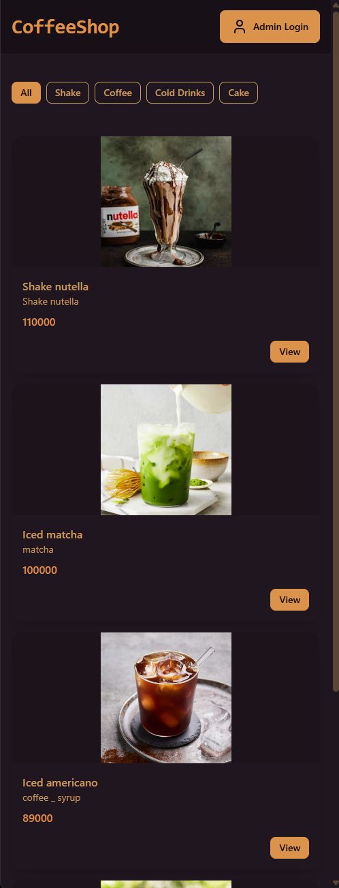
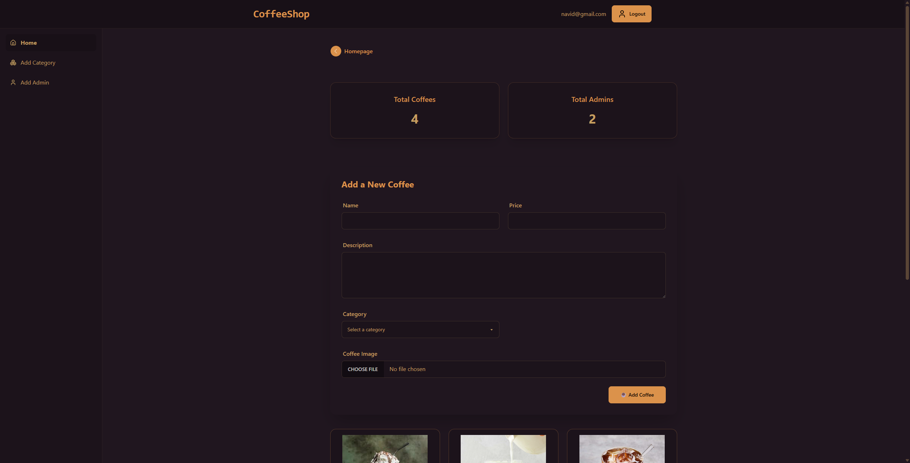
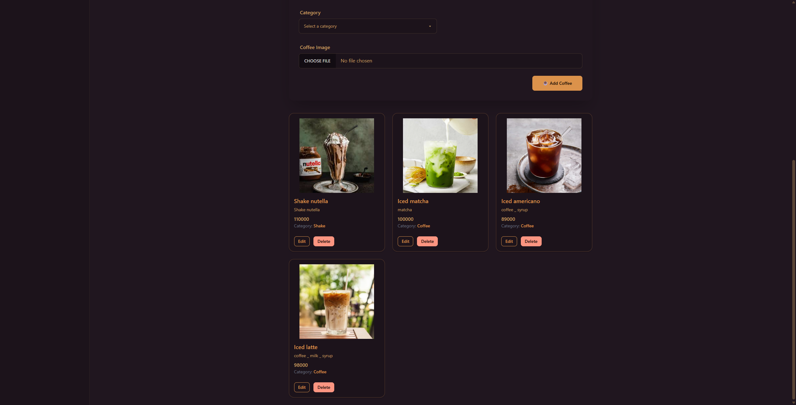

# ☕ MERN Coffee Shop Website

**A Coffee Shop website made by MERN tech stack**  
یک وبسایت کافه ساخته شده با تکنولوژی MERN

---

## 🧠 Overview

This is a full-stack coffee shop web application built using the **MERN** stack (MongoDB, Express.js, React, Node.js).  
It includes both a **frontend** and **backend**, with authentication, admin features, and coffee product management.

---

## ⚙️ Environment Configuration

To run this project, you need to create an `.env` file and fill in the following environment variables.  
These variables configure the database connection and default login credentials.

| Variable             | Description                           | Example                                                      |
| -------------------- | ------------------------------------- | ------------------------------------------------------------ |
| `MONGO_URI`          | MongoDB connection string             | `mongodb+srv://<user>:<pass>@cluster.mongodb.net/coffeeshop` |
| `DEFAULT_EMAIL`      | Default admin email used for login    | `admin@coffeeshop.com`                                       |
| `DEFAULT_PASSWORD`   | Default admin password used for login | `123456`                                                     |
| `VITE_DEFAULT_EMAIL` | Default email visible to the frontend | `admin@coffeeshop.com`                                       |

> 🧩 Place your `.env` file inside the **backend** directory.

---

## 🛠️ Installation Production Mode

```bash
npm run build
npm run start

---

## 📸 Screenshots

<p align="center">
  
</p>
<p align="center">
  
</p>
<p align="center">
  
</p>

```
